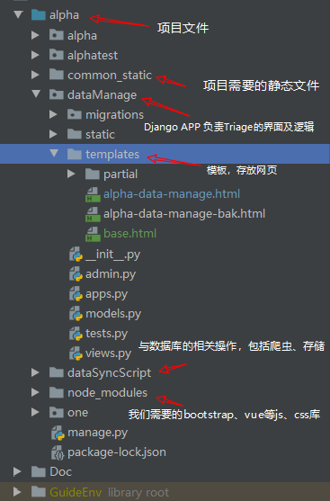
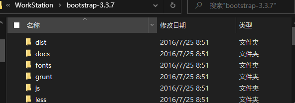
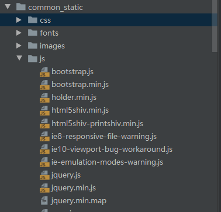
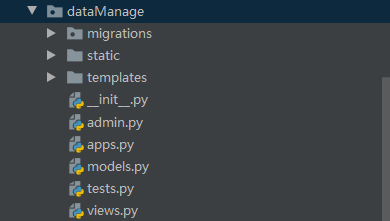
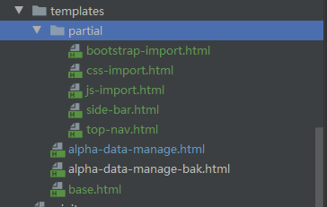
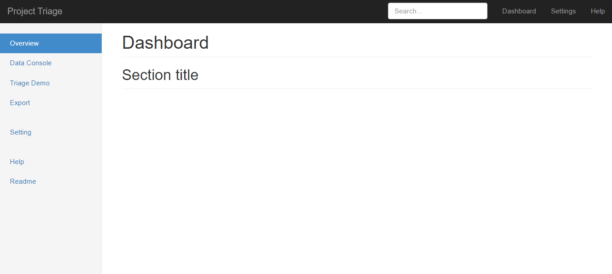

# 创建项目

前端建站使用Python3.6.5  + Django2.2.7，

利用BVDN架构（Bootstrap、Vue、Django、Nginx）

**Bootstrap**负责界面，也就是用户直接看到的部分，Bootstrap是目前特别火的前端框架，许多网站的页面都是基于Bootstrap编写的。

**Vue**负责前端的运作，也就是网页内的代码。

**Django**是后端框架，负责网站后端的运作。

**Nginx**负责把你在电脑上用Django建出的后台程序部署在服务器上。


## 所需包

python-pip包管理工具、setuptools、bootstrap、vue、jquery、nginx

```cmd
npm install bootstrap
npm install vue
npm install jquery
npm install vue-router
```

将 bootstrap中的dist中的文件放入/static，vue、jquery、vue-router中的dist中的文件放入/static/js

## 安装包

Django 、mysqlclient-1.4.6

``` python
pip install Django==2.2.7
# 进入python, 检查是否安装完成
import django
django.VERSION
```

> Django 2.0.x 支持 Python 3.4, 3.5 和 3.6 （最后一个支持 Python 3.4 的版本）
>
> Django 2.1.x 支持 Python 3.5, 3.6 和 3.7
>
> **Django 2.2.x 支持 Python 3.5, 3.6 和 3.7 （LTS 长期支持版本**

## 创建Django项目

``` python
django-admin startproject alpha
cd alpha
python manage.py runserver
```

## 项目目录

### 下载安装Bootstrap及Vue
这里提供两种下载方式
``` python
npm install bootstrap@3.3.7
npm install jquery@1.12.4
npm install vue@2.6.11
npm install vue-router@3.1.6
```
npm下载后文件会保存在**node_modules**
其次就是官网下载压缩包源码，解压后得到

dist文件夹中有js、css、fonts文件，这些文件之后会用到。
也可以使用cdn在线导入js、css等库。
### 使用Bootstrap及Vue
在项目根目录下创建文件夹，这里为common_static,在common_static中创建css、fonts、images、js等静态文件保存的目录。
将npm下载的文件中的dist目录中的文件分别保存到上述文件目录，例，


## 页面Templates
在Django APP文件夹下创建templates文件夹。例，

根据需求，从Bootstrap中下载模板

partial文件夹是我们抽取出的组件，base.html包含各组件，可由新页面如alpha-data-manage.html继承。
**运行如图**



