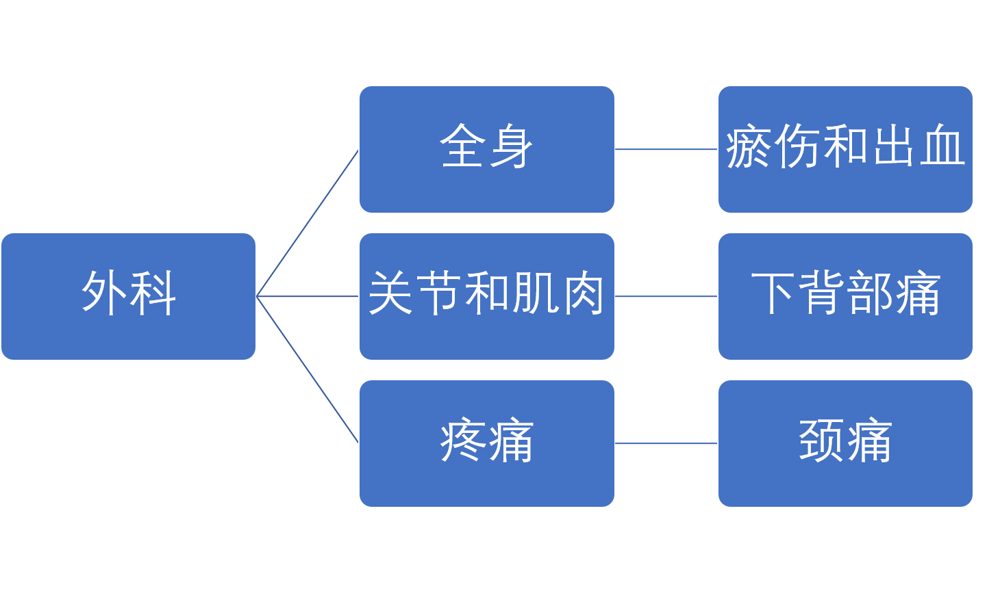
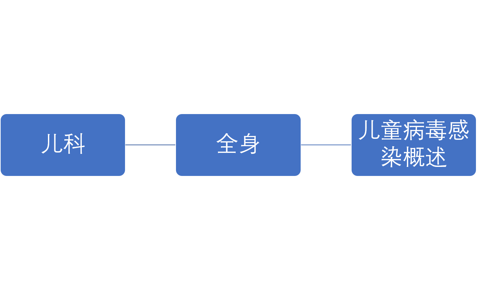

# 系统设计
> 目前每种具体症状都有三个以上角度，**原因**、**评估**、**治疗**、**关键点**、**类型**、**预防**等。
## 需求
- [ ] 判断用户所挂科室
    > 通过解析用户身体出现不适的部位，具体的症状表现（非标准语言），匹配到数据库中每个Symptoms的症状表现（标准语言）。
    ###1. 科室分类
    内科：不开刀的科室、现代中也常有注射、镜检等手术
    > 呼吸内科 消化内科 神经内科 心血管内科 肾内科 血液内科 风湿免疫科 内分泌科     
    
    
    
    外科：需要开刀的疾病，该说法笼统片面
    > 神经外科 心血管外科 胸外科 普通外科 肝胆外科 肛肠外科 泌尿外科 血管外科 乳腺外科 微创外科 器官移植
    
    

    妇产科：
    > 妇科（子宫颈息肉、不孕不育等） 产科（产前检查、分娩、妊娠等）
    
    
    
    儿科：
    > 小儿内科 小儿外科
    
    
    
    ~~眼科：~~
    
    ~~耳鼻咽喉科（五官科）：诊断治疗耳、鼻、咽、喉、及其相关头颈区域的外科学科~~
    
    ~~口腔科：口腔内科、口腔矫正~~
    
    五官科：
    > 眼科 耳鼻咽喉科 口腔科
    
    
    
    皮肤科：
    > 皮肤病
    
    
    
    